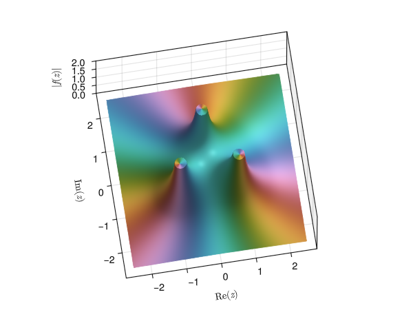

<div align="center">
  
  <h1>ComplexToys.jl</h1>
</div>
<p>
  <a href="https://eprovst.github.io/ComplexToys.jl/dev/">
    </a>
</p>

A collection of useful plotting routines for teaching and learning complex
analysis based on [DomainColoring.jl](https://eprovst.github.io/DomainColoring.jl).
Take a look at [the guide](https://eprovst.github.io/ComplexToys.jl/dev/guide/)
to get started.

To install run:
```julia
using Pkg; pkg"add ComplexToys"
```

The package includes interactive versions of the plots included in DomainColoring.jl:
- `domaincolor(z->f(z))` plots various domain colorings of $f$;
- `checkerplot(z->f(z))` and `sawplot(z->f(z)` plot various properties of $f$ in gray scale; and
- `pdphaseplot(z->f(z)` and `tphaseplot(z->f(z)` provide phase plots of $f$ readable to people with color vision deficiency.

A more comprehensive overview of these functions is given in the [DomainColoring.jl documentation](https://eprovst.github.io/DomainColoring.jl).

Additionally, a collection of three dimensional plots is provided:
- `modularsurface(z->f(z))` plots a modular surface of $f$, i.e. a surface plot of the magnitude;
- `riemannsphere(z->f(z))` plots a domain coloring of $f$ on the Riemann sphere;
- `riemannpow(k)` plots a projection of the Riemann surface of $z^k$; and
- `riemannlog()` plots a projection of the Riemann surface of $\log(z)$.

