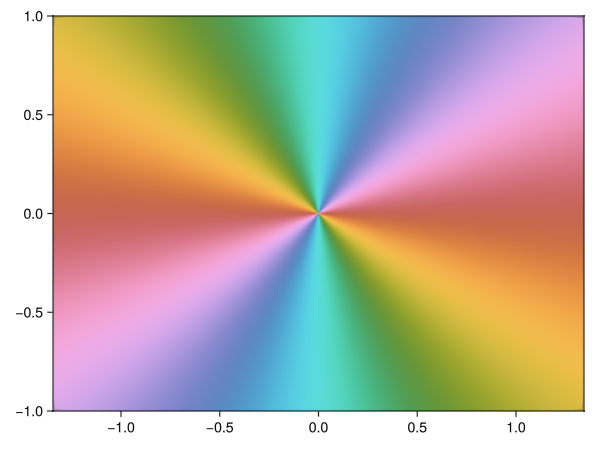
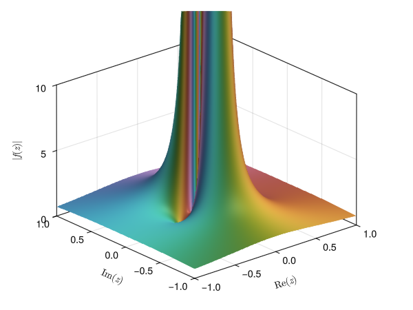
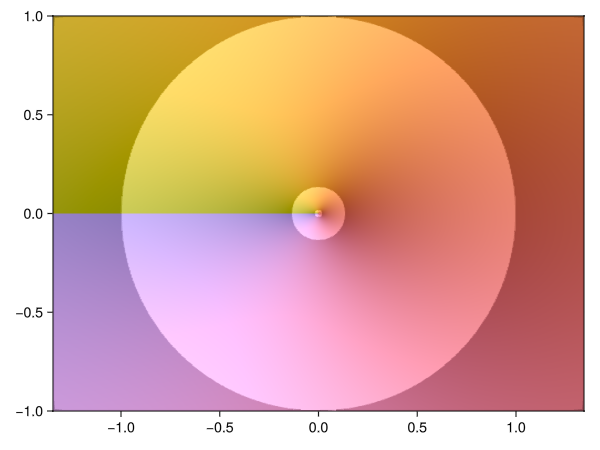
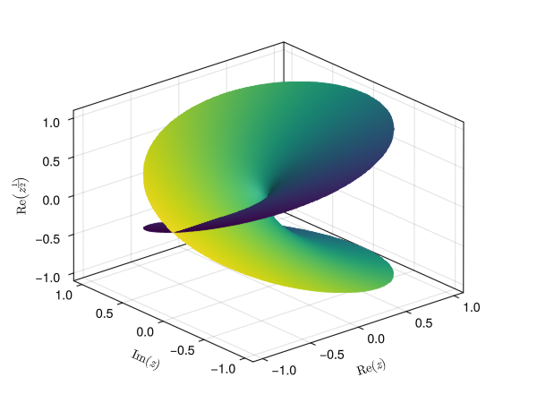
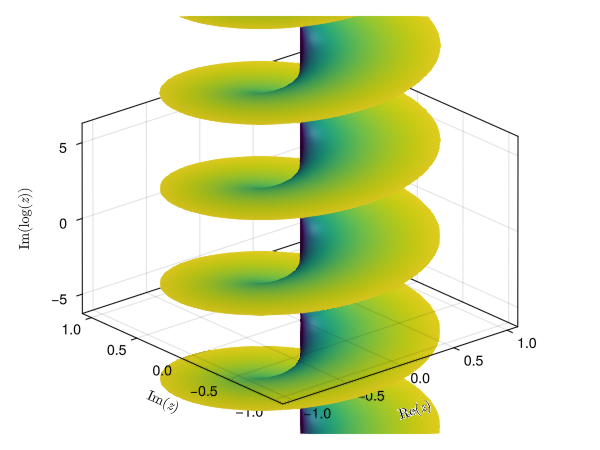

# Guide

(This document is also available in [PDF
format](https://raw.github.com/eprovst/ComplexToys.jl/main/guide/guide.pdf).)

## Installation

`ComplexToys.jl` is a collection of plotting tools to aid the study of complex
analysis. It is implemented in Julia, a modern and—at least in the author's
opinion—a rather pleasant language to use.  No prior knowledge of Julia is
needed to go through this document as concepts will be introduced where
needed. If Julia is not yet installed on your system, you can use the usual
method of your operating system or download it from <https://julialang.org>.

To install the plotting routines, you enter the following commands in the Julia
REPL (read eval print loop).

!!! note
    Depending on the speed of your machine, this might take a while. Grab a
    cup of tea or coffee and take a minute to enjoy the outdoors. :-)

```julia
using Pkg
pkg"add ComplexToys"
```

## A first phase plot

To start producing plots, you first have to load the package you just installed
with the `using` keyword.

```julia
using ComplexToys
```

In the remainder of this tutorial we will discuss several plots, starting with
the phase plot (we will explain the name `domaincolor` in the next section). On
such a plot, we display the phase, or argument, by painting $\arg z = 0$ red,
$\arg z = \frac{\pi}{2}$ lime green, $\arg z = \pi$ cyan, $\arg z =
\frac{3\pi}{2}$ purple, etc.

```julia
domaincolor(z -> z)
```
```@raw html
<figure>
```

```@raw html
</figure>
```

Note that a zero, going anticlockwise, is surrounded by red, green and finally
blue. A pole on the other hand (below one of second order) reverses this order,
giving red, blue and then green. This is a useful trick to quickly spot poles
and zeroes on a phase plot, but be aware that this is only true if no complex
conjugation is involved!

```julia
domaincolor(z -> 1/z^2)
```
```@raw html
<figure>
```

```@raw html
</figure>
```

Note the first bit of Julia syntax you will need: an anonymous function (a
function you can easily pass as an argument) is written as `z -> f(z)`,
analogous to $z \mapsto f(z)$ in mathematics.

It is perhaps interesting to know that this reversal of the phase relates to the
complex conjugate. The function $z \mapsto \frac{1}{z}$ is namely the
composition of $z \mapsto \frac{1}{\bar{z}} = \frac{1}{|z|} e^{i\arg z}$ and
$z \mapsto \bar{z} = |z| e^{-i\arg z}$. In the first step, the unit circle is
turned inside out; the second step mirrors the image along the real axis.

This is easily seen by looking at the effect these steps have on a square, or
algebraically by noting that only the final step modifies the phase.

```julia
domaincolor(z -> z, 2, box=(.4,.6+.2im,:white))
domaincolor(z -> 1/conj(z), 2, box=(.4,.6+.2im,:white))
domaincolor(z -> 1/z, 2, box=(.4,.6+.2im,:white))
```
```@raw html
<div style="display: grid; grid-column-gap: 1.5em; grid-template-columns: repeat(auto-fit, minmax(220px, 1fr)); margin: 1.5em;">
<figure style="margin: 0;">
  
<figcaption>
```
$z \mapsto z$
```@raw html
</figcaption>
</figure>
```
```@raw html
<figure style="margin: 0;">
  
<figcaption>
```
$z \mapsto \frac{1}{\bar{z}}$
```@raw html
</figcaption>
</figure>
```
```@raw html
<figure style="margin: 0;">
  
<figcaption>
```
$z \mapsto \frac{1}{z}$
```@raw html
</figcaption>
</figure>
</div>
```

In the above code, the second argument fixes the range of the axes. For the
specific details about the `box` keyword argument we refer to the documentation
(try: `? domaincolor`, more on this later). Also note the use of `im` as
imaginary unit in Julia.

We conclude by mentioning that these plots are interactive. Try, for instance,
to explore the phase of the sine function with `domaincolor(z -> sin(z))`.
Initially it looks very similar to the identity function of before, not
unexpected when you remember its Taylor series.  To get a better picture you can
zoom in and out using the scroll wheel, or zoom to a region using left click and
drag.  The centre of the plot can be dragged around using the right mouse
button.  Finally, if you get lost, you can always reset the view using ctrl +
left click.

## Domain colouring and modular surfaces

Given that $z \mapsto \frac{1}{z}$ and $z \mapsto \bar{z}$ have identical phase,
a phase plot alone is not always sufficient to study a function's behaviour.
For this reason it is common to add contour lines of the magnitude (usually more
specifically of its logarithm). The resulting figure is called a domain
colouring (hence `domaincolor`). We can add the contours using the option
`abs=true`. This way we can distinguish the pole (left, with *increasing*
lightness between contours) and zero (right, with *decreasing* lightness between
contours) in the below example.

```julia
domaincolor(z -> (conj(z) - .5)/(z + .5), abs=true)
```
```@raw html
<figure>
```

```@raw html
</figure>
```

Of course there are many variations on this idea. One could, for example, paint
zero black and infinity white. This is for instance useful to illustrate the
Casorati–Weierstrass theorem.

```julia
domaincolor(z -> exp(1/z), .2, abs=Inf)
```
```@raw html
<figure>
```

```@raw html
</figure>
```

Aside from what is illustrate here, many other options are available, for
instance grid lines and colour vision deficiency friendly phase plots. For a
list of all the available options you can consult a function's documentation
using `?`, for example:

```julia
? domaincolor
```

The 2D plots included in `ComplexToys.jl` are interactive version of those
found in a different Julia package called `DomainColoring.jl`; visit [their
documentation](https://eprovst.github.io/DomainColoring.jl) for more
information and examples.

Yet another way to represent magnitude and phase at the same time, is by moving
the former to the third dimension, which results in a (painted) modular surface.
Another essential singularity we can visualize is $z \mapsto
\sin\left(\frac{1}{z}\right)$ near $0$.

```julia
modularsurface(z -> sin(1/z))
```
```@raw html
<figure>
```

```@raw html
</figure>
```

For this example—as with all other 3D plots—it is worthwhile to plot the
figure yourself. This additionally allows you to rotate the plot.

## Branch points and Riemann surfaces

When looking at the domain colouring of $z \mapsto z^2$ we see the same values
appear twice in the complex plane.

```
domaincolor(z -> z^2, abs=true)
```
```@raw html
<figure>
```

```@raw html
</figure>
```

The inverse map $z \mapsto z^{\frac{1}{2}}$ will hence take two values in any
given point. An exception is $0$, where the inverse map is unique. Such a point
$z_0$ where a map has $n$ values (here $n=1$), but every neighbour has strictly
more than $n$ values, is called a *branch point* (more precisely: every
neighbourhood of $z_0$ has at least one point where the map takes at least $n+1$
values).

If we want to arrive at a single valued function, we will have to choose between
one of the two values. The usual approach for a continuous function is to pick
an arbitrary curve (the *branch cut*) connecting two branch points, and to
require continuity everywhere except when crossing this curve. This results in a
set of single valued functions (so called *branches*) which can be attached
along this curve in a continuous fashion.

For $z \mapsto z^\frac{1}{2}$, the usual choice of branch cut is the negative
real axis (connecting the branch points $0$ and $\infty$), as is also done in
Julia. This is a result of the convention to use ${|z|}^{\frac{1}{n}} e^{i
\frac{\mathrm{Arg}\,z}{n}}$ as the so-called \emph{principal value} of the $n$th
root, with $\mathrm{Arg}\,z \in (-\pi, \pi]$ the principal value of the
argument. Analogously, the principal value of the logarithm is given by
$\mathrm{Log}\,z = \log |z| + i\,\mathrm{Arg}\, z$, which is of course
compatible with the preceding.

```julia
domaincolor(z -> z^(1/2), abs=true)
```
```@raw html
<figure>
```

```@raw html
</figure>
```

Additionally, we could also try to make a plot of all the values at the same
time. Note that this is a four dimensional object. For $w = f(z)$ we namely have
$(\mathrm{Re}\,z, \mathrm{Im}\,z, \mathrm{Re}\,w, \mathrm{Im}\,w)$ as
graph. (One can, of course, also use the phases and magnitudes.)

When we project this orthogonally on the first three components and colour the
resulting surface according to the removed component, we get the following for
$z \mapsto z^{\frac{1}{2}}$.

```julia
riemannpow(1//2)
```
```@raw html
<figure>
```

```@raw html
</figure>
```

Here `1//2` is Julia notation for the exact rational number $\frac{1}{2}$. On
the negative real axis the graph seems to intersect itself, but this is merely
an artefact of the chosen projection. The colour is in fact distinct. Note that
indeed each point, except for the branch point $0$, has two distinct values.

We encourage you to play around with different rational numbers and to look what
does (and what does not) change the number of values. Also try an irrational
power; note that it never reattaches to itself, *it takes an infinite number of
values!*

A 'simpler' example of a function that takes infinitely many values is $\log z =
\log |z| + i\arg z$.  Using a slightly different projection, we get a rather
nice looking staircase.

```julia
riemannlog()
```
```@raw html
<figure>
```

```@raw html
</figure>
```

## On the Riemann sphere

Finally, `ComplexToys.jl` is also able to plot a function on the Riemann sphere.
Let us, to conclude, again look at the sine, with a zero at the origin (south
pole) and an essential singularity at infinity (north pole).

```julia
riemannsphere(sin)
```
```@raw html
<figure>
```

```@raw html
</figure>
```
