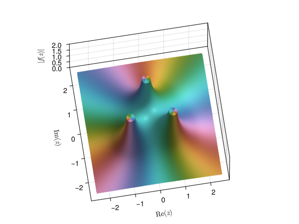

# ComplexToys.jl: Didactical Tools for Complex Analysis

Welcome to the documentation of the `ComplexToys.jl` package, a
collection of useful plotting routines for teaching and learning complex
analysis, based on [Makie](https://makie.org), often taking inspiration
in the work of Wegert.[^1]

```@raw html
<div align="center">
  
</div>
```

This online documentation is under construction. Take a look at [the
guide](https://raw.github.com/eprovst/ComplexToys.jl/main/guide/guide.pdf)
to get started, or use the built-in help functionality of the Julia REPL.

To install run:
```julia
using Pkg
pkg"add ComplexToys"
```

Included plotting routines:

- `modularsurface(z->f(z))` plots a modular surface of $f$, i.e. a surface plot of the magnitude;
- `riemannsphere(z->f(z))` plots a domain coloring of $f$ on the Riemann sphere;
- `riemannpow(k)` plots a projection of the Riemann surface of $z^k$; and
- `riemannlog()` plots a projection of the Riemann surface of $\log(z)$.

Next to the routines in this package, DomainColoringToy is reexported.
See [their documentation](https://eprovst.github.io/DomainColoring.jl/stable/dct/)
for domain colourings, checker plots, etc.

[^1]:
    Wegert, Elias. Visual Complex Functions: An Introduction with Phase
    Portraits. Birkhäuser Basel, 2012.

